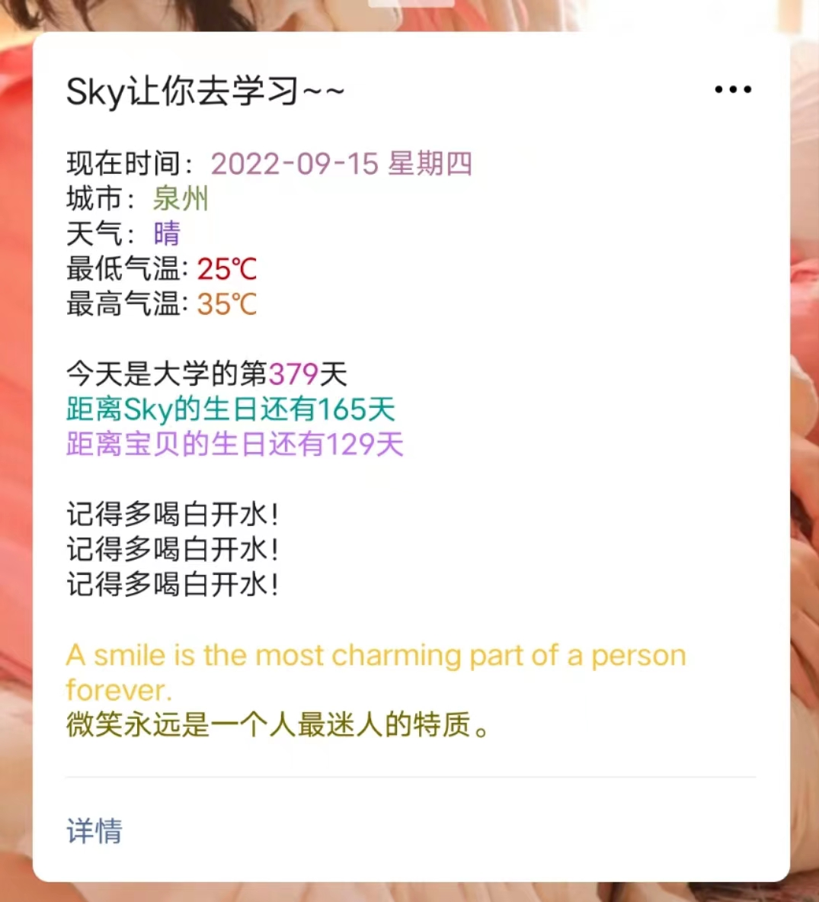

## 效果



## 如何使用

**①申请一个公众号接口测试**

地址：https://mp.weixin.qq.com/debug/cgi-bin/sandbox?t=sandbox/login

**②新增一个测试模板填入一下内容**

> 文字部分可修改

```
现在时间：{{date.DATA}} 
城市：{{city.DATA}} 
天气：{{weather.DATA}} 
最低气温: {{min_temperature.DATA}} 
最高气温: {{max_temperature.DATA}} 

今天是大学的第{{love_day.DATA}}天 
{{birthday1.DATA}} 
{{birthday2.DATA}} 

记得多喝白开水！
记得多喝白开水！
记得多喝白开水！

{{note_en.DATA}} 
{{note_ch.DATA}}
```

**③fork此仓库到自己的仓库**

**④修改config.txt配置文件**

> config.txt

```json
{
# 公众号配置
# 公众号appId
"app_id": "xxx",
# 公众号appSecret
"app_secret": "xxx",
# 模板消息id
"template_id": "xxx",
# 接收公众号消息的微信号，如果有多个，需要在[]里用英文逗号间隔，例如["wx1", "wx2"]
"user": ["oxx"],

# 信息配置
# 所在省份
"province": "福建",
# 所在城市
"city": "泉州",
# 生日1，修改名字为对应需要显示的名字，如果生日为农历，在最前面加上r即可
"birthday1": {"name": "Sky", "birthday": "r2002-02-08"},
# 生日2
"birthday2": {"name": "宝贝", "birthday": "r2002-01-01"},
# 在一起的日子，格式同上
"love_date": "2021-09-01"
}
```

**⑤配置weixin.yml文件**

> 文件路径.github/workflows

```yml
name: weixin
on:
  workflow_dispatch:
  schedule: 
    # 代表国际标准时间4点0分，北京时间需要+8小时，代表北京时间中午12点运行
    - cron: '0 5 * * *'
jobs:
#将工作流程中运行的所有作业组合在一起
  build:
  #定义名为 build 的作业。 子键将定义作业的属性 
    runs-on: ubuntu-latest 
    steps:
      - uses: actions/checkout@v2
    
      - name: Set up Python 3.9
        uses: actions/setup-python@v2
        with:
          python-version: 3.9.1
      - name: install pip packages
        run: |
          python -m pip install --upgrade pip
          pip3 install -r requirements.txt
      - name: weixin
        run: |
          python3 main.py
```

**⑥用Actions运行测试**